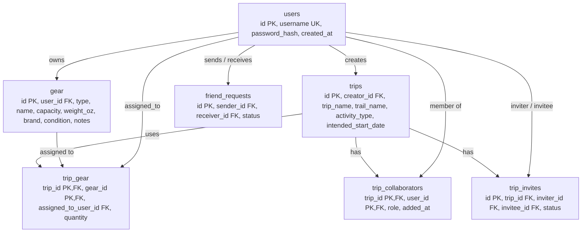
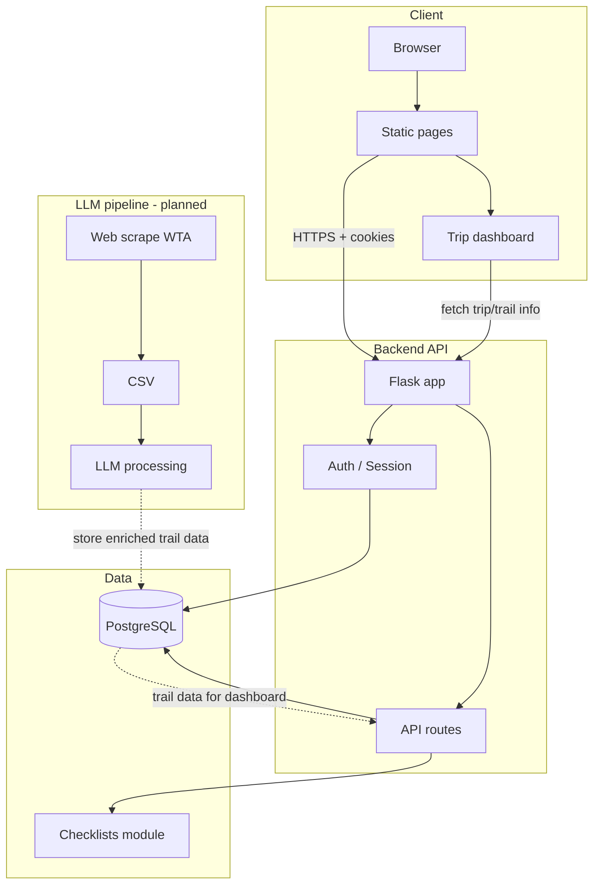

# TrailFeathers SDS Diagrams

**Purpose:** Software Design Specification diagrams (ER, architecture). Export via mermaid.live or SDS_diagrams.html.  
**Group:** TrailFeathers  
**Authors (alphabetically by last name):** Kim, Smith, Domst, and Snider  
**Last updated:** 3/13/26

Use this doc to export diagrams for the NewSDS (Figure 6 + architecture). Options: paste Mermaid into [mermaid.live](https://mermaid.live) to export PNG/SVG, open `SDS_diagrams.html` in a browser to view and screenshot, or use the text descriptions with an image-generation LLM.

---

## Diagram 1: Figure 6 – Database structure (ER)

### Mermaid (copy into mermaid.live to export image)

### Text description for LLM image generation

"Entity-relationship diagram for a hiking trip app database. Seven tables in boxes with attributes listed inside. Central table: users (id, username, password_hash, created_at). Other tables: gear (id, user_id FK, type, name, capacity, weight_oz, brand, condition, notes, created_at); trips (id, creator_id FK, trip_name, trail_name, activity_type, intended_start_date, created_at); trip_collaborators (trip_id PK,FK, user_id PK,FK, role, added_at); trip_invites (id, trip_id, inviter_id, invitee_id, status, created_at); trip_gear (trip_id PK,FK, gear_id PK,FK, assigned_to_user_id FK, quantity); friend_requests (id, sender_id FK, receiver_id FK, status, created_at). Arrows: users to gear (owns), users to trips (creates), users and trips to trip_collaborators (member of / has), users and trips to trip_invites (invites / invited / has), trips and gear and users to trip_gear (uses / assigned to / assigned_to), users to friend_requests (sends / receives). Clean technical diagram style, white background, black lines and text."

---

## Diagram 2: System architecture (including LLM pipeline)

### Mermaid (copy into mermaid.live to export image)

Legend: solid arrows = implemented; dashed arrows = planned.

### Text description for LLM image generation

"System architecture flowchart for a web app called TrailFeathers. Four main groups. 1) Client: Browser, Static pages, Trip dashboard; Browser to Static to Trip dashboard. 2) Backend API: Flask app, Auth/Session, API routes; Flask connects to Auth and Routes. 3) Data: PostgreSQL database cylinder, Checklists module. 4) LLM pipeline (labeled 'planned'): Web scrape WTA, CSV, LLM processing; Scrape to CSV to LLM; dashed arrow from LLM to PostgreSQL 'store enriched trail data'. Arrows: Static pages to Flask 'HTTPS + cookies'; Routes to DB; Auth to DB; Routes to Checklist; Trip dashboard to Flask 'fetch trip/trail info'; dashed arrow from DB to Routes 'trail data for dashboard'. Left-to-right layout, boxes and cylinders, clean technical diagram, white background."

---

## Quick export steps

1. **PNG/SVG**: Copy each Mermaid block above into [mermaid.live](https://mermaid.live), then use Export (PNG or SVG).
2. **View in browser**: Open `SDS_diagrams.html` in a browser; use screenshot or Print to PDF to capture each diagram.
3. **LLM image**: Paste the corresponding text description into an image-generation tool (e.g. DALL-E, Midjourney, Ideogram) to get a diagram image.
